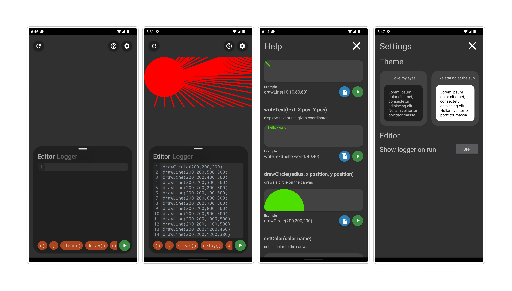

# Blanca
**Blanca app**
Blanca is drawing app that allows users to draw objects on the screen using the blanca programming langauge.

**Blanca DUMAS Interpreter**
Blanca DUMAS Interpreter is a ~~Ultra fast~~, ~~Highly efficient~~ Functional programming language designed for drawing objects. DUMAS pronounced *dumbass* stands for Design Utility Methods only Application Syntax. DUMAS is designed to make it easier for typing code on mobile.

# Documentation

###comments

DUMAS comments are one of the easiest comment styles compared to any other programming langauge. DUMAS provides a very efficient and scaleable way of writing comments. 

**Single line comment**
`// this is a single line comment`

**two line comment**

`//this is a`

`//two line comment`

**three line comment**

`//this is a`

`//three line`

`//comment`

###drawing

**drawCircle(radius, posX, posY)**
Draws a circle of a given radius at a position (x, y) on the UI

**drawLine(startX, startY, endX, endY)**
Draws a line from a start point x and y to and end point x and y

**writeText(text, posX, posY)**
Draws text at the given x and y position

**clear()**
Clears the blanca canvas

###loops
Repeating actions on blanca is extremely simple. Here is an example how to draw 3 circles on the UI :

    drawCircle(100,100,100)
    drawCircle(100,200,200)
    drawCircle(100,300,300)

its as simple as that.
JK, loops are WIP.

